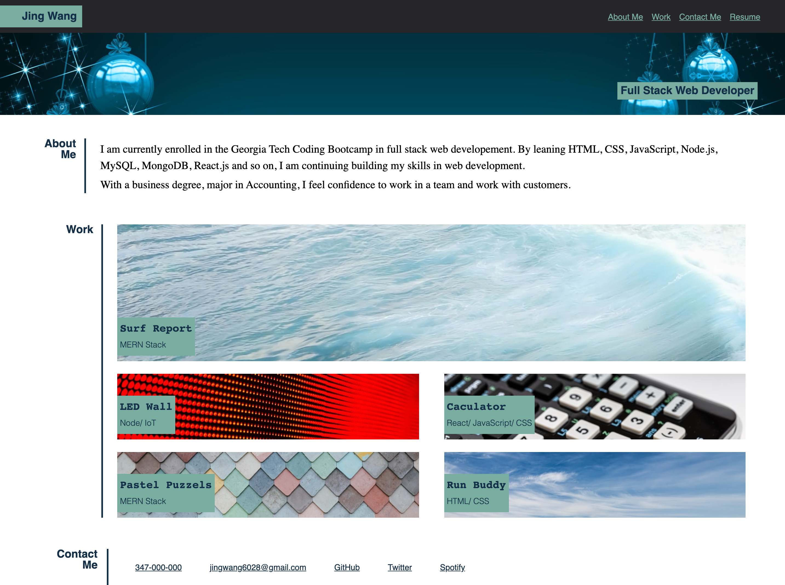
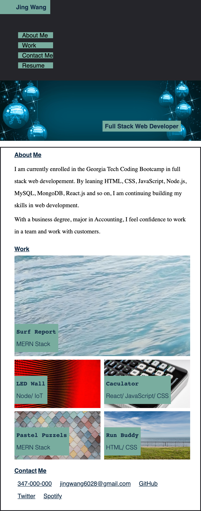

# My-Portfolio

## Description

In this project, my task is to create a website which contains portfolios of work to show my skills and talent to employers. This website is composed by three parts, which are self-introduction section, work portfolio section and contact information section.

## Requirement

1. Desveloper's name and links to each sections, work portfolio, and contact information are presented.
2. Links in the navigation are corresponding to each section.
3. Link in each titled image links to developer's application.
4. Application's image is larger in size when hover on the image.
5. Presented with a responsive layout that adapts to the viewport when resize the page or view on various screens and devices.

## Link URL to GitHub Repository

https://github.com/jingwang6028/My-Portfolio

## Link URL to GitHub Page

https://jingwang6028.github.io/My-Portfolio/

Mock-up Image

1. This iamge shows the web application's apprearance and functionality in a laotop screen size.
   
2. This image shows the web application's apprearance and functionality in a smart phone screen size.
   
